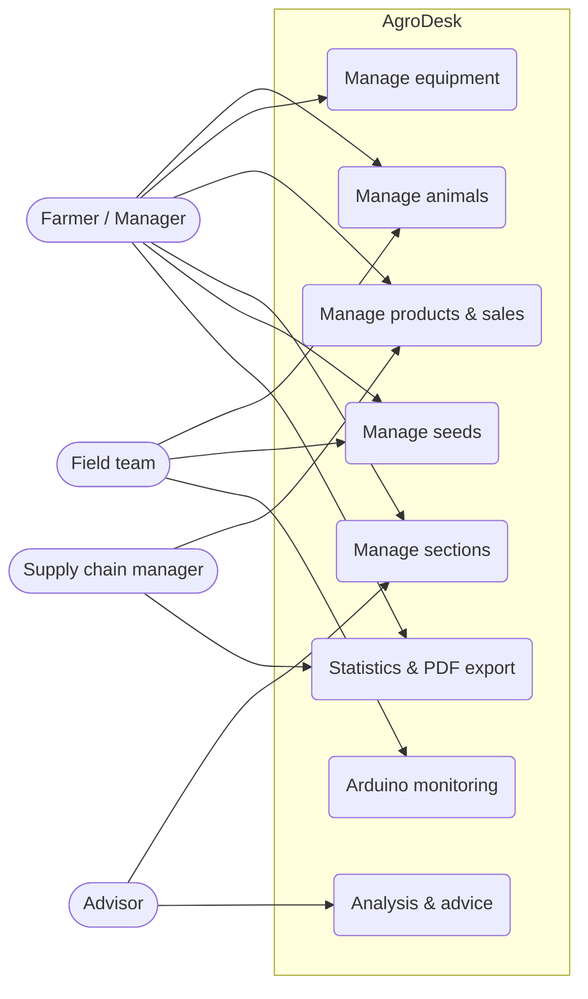
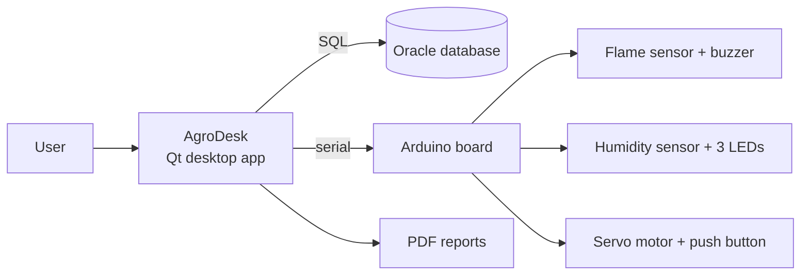
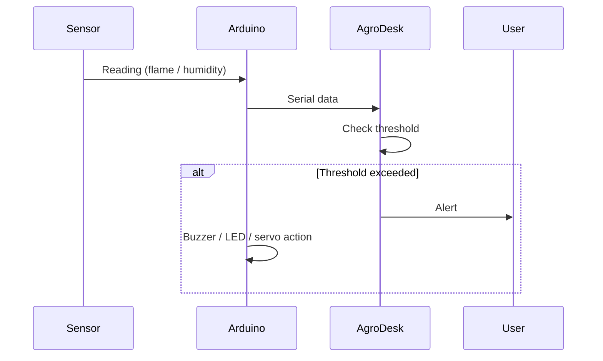
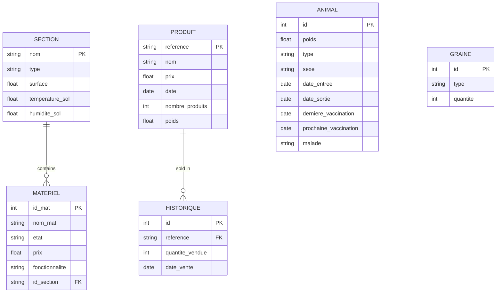

# 🌱 AgroDesk

> **Smart Farm**: a smart desktop application for farm management, connected to Arduino IoT scenarios.

Developed by **AgroDeskStudio**.

  

## 1. Overview

**AgroDesk** is a desktop application that lets farmers and farm managers supervise and organize the key resources of a farm: **animals, equipment, products, sections (plots) and seeds**.

**Problem addressed:** how can AgroDesk improve productivity by solving the specific challenges of managing seeds, products, sections, animals and farm equipment?

**What makes it different:** one integrated platform covering animal health, equipment maintenance, plot planning, seed cultivation and product traceability, plus Arduino sensors for real-world monitoring.

Competing apps: FarmLogs, Farmbrite.

## 2. Actors

| Actor | Usage |
|---|---|
| **Farmer** | Day-to-day management of animals, seeds, products and equipment |
| **Farm manager** | Supervision, statistics, PDF reports, decision making |
| **Field team** | Logs data in the field (sowing, feeding, maintenance) |
| **Supply chain manager** | Product stock, sales and traceability |
| **Agricultural advisor** | Uses analyses and advice on soil and crops |



## 3. Modules

Every module supports the core operations: **add, edit, delete, display, search, sort, statistics and PDF export**.

| Module | Features |
|---|---|
| 🐄 **Animals** | Records (weight, type, sex, entry/exit dates), **vaccination alerts**, **disease probability from symptoms** with statistics, Arduino feeding schedule |
| 🚜 **Equipment** | Add/display/delete/search, ascending/descending sort, **price estimation**, **maintenance** of broken equipment |
| 🥕 **Products** | Product catalog, **sales transactions**, **history**, statistics, calendar, stock control |
| 🌍 **Sections** | Plot data (type, surface, soil temperature and humidity), statistics, **soil analysis and advice** |
| 🌾 **Seeds** | Seed inventory (type, quantity), **sowing**, stock control, sort by id, statistics, Arduino link |

## 4. Architecture



## 5. Arduino scenarios

| Scenario | Purpose | Hardware |
|---|---|---|
| 🔥 **Fire detector** | Safety with a flame sensor, buzzer alert | Arduino, breadboard, jumper wires, flame sensor, buzzer |
| 💧 **Humidity monitoring** | Monitor and control soil humidity | Arduino, breadboard, jumper wires, humidity sensor, 3 LEDs |
| 🍽️ **Feeding system** | Schedule animal feeding with a servo motor | Arduino, breadboard, jumper wires, servo motor, push button |



## 6. Data model

> Based on the application screens. Adjust to your real Oracle schema.



## 7. Tech stack

| Area | Technologies |
|---|---|
| Desktop app | Qt (C++), Qt Widgets |
| Database | Oracle, SQL Developer |
| IoT | Arduino |
| Export | PDF generation (Qt) |
| Design | Green palette, font *MS Shell Dlg 2* |

## 8. Getting started

### Prerequisites

- Qt 5/6 with Qt Creator (and the SQL driver for Oracle/ODBC)
- Oracle Database (or Express Edition) and SQL Developer
- Arduino IDE (only for the hardware scenarios)

### Run

```bash
git clone <REPO_URL>
cd <REPO_FOLDER>
```

1. Create the database tables with SQL Developer (run the SQL script of the project).
2. Open the `.pro` file in **Qt Creator**.
3. Configure the database connection (data source name, user, password) in the connection class.
4. Build and run (`Ctrl+R`).

> Never commit real passwords or API keys. Keep them in local config files listed in `.gitignore`.

### Arduino

1. Wire the components as described in section 5.
2. Upload the sketch with the Arduino IDE.
3. Select the correct COM port in AgroDesk.

## 9. Sustainable development

AgroDesk contributes to these UN Sustainable Development Goals:

| SDG | Contribution |
|---|---|
| **3**, Good Health | Crop health monitoring to detect diseases and pests |
| **7**, Clean Energy | Monitoring and optimizing solar energy use on the farm |
| **12**, Responsible Consumption | Environmental impact reports for sustainable decisions |
| **15**, Life on Land | Planning environment-friendly farming practices |

## 10. Git workflow

```bash
git checkout -b your-name/feature-name
git checkout main && git pull origin main
git checkout your-name/feature-name && git merge main
git add . && git commit -m "feat(animals): add vaccination alerts"
git push -u origin your-name/feature-name
```

- Never work directly on `main`
- One branch per feature, clear commit messages
- Open a Pull Request on GitHub when done
